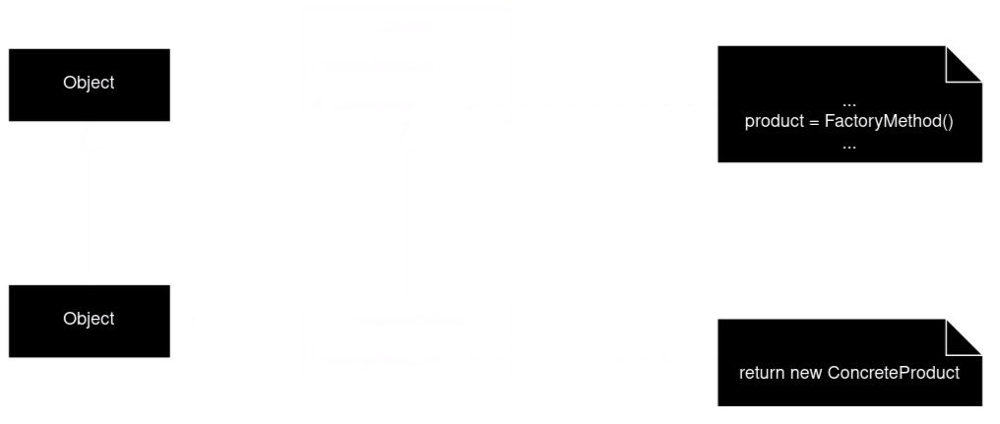

# Factory Method

## TLDR
Factory method delegates object creation to subclasses. Factory Method defines interface and subclasses instantiate object.

## When to use
1. Can't antisipte what objects needs to be created, the responsibility of creation is on the subclasses.
1. Demand for adding new products in the future.

## Description
### UML 

- Product
    - Defines the interface of objects the factory methd creates.
- ConcreteProduct
    - implements the Products interface.
- Creator
    - declares the factory method, which returs an object of type Product.
    - optional: Creator can define a default factory method and returns default ConcreteProduct object.
    - may call the factory method to create a Product object.
- ConcreteCreator
    - overrides the factory method the retrun an instance of ConcreteProduct.

### Notes
- Creating object inside a class via factory method is generaly more flexible then creating objects directly.
- Parallel class hierarchies are classes that delegates some of its responsibilities to separate class, hence factory method can be called by other parallel classes.
- Varieties:
    - Creator class is an abstract class and doesn't define implemitation of factory method
        - subclasses required to define implemitation(no default), solves the problem with instantiating unknow classes in advance.
    - Creator class is a concrete class with a default implemitation of factory method
        - enables flexibilty for subclasses to overide their own creation.
    - Parameterized factory method
        - factory method can take parameters to create diffrent kind of objects with shared interface.
## Code snippet
```
from __future__ import annotations
from abc import ABC, abstractmethod


class Creator(ABC):

    @abstractmethod
    def factory_method(self):
        pass

    def some_operation(self) -> str:
        product = self.factory_method()
        result = product.operation()

        return result


class ConcreteCreator1(Creator):
    def factory_method(self) -> Product:
        return ConcreteProduct1()

class ConcreteCreator2(Creator):
    def factory_method(self) -> Product:
        return ConcreteProduct2()


class Product(ABC):
    @abstractmethod
    def operation(self) -> str:
        pass


class ConcreteProduct1(Product):
    def operation(self) -> str:
        # do some stuff
        pass


class ConcreteProduct2(Product):
    def operation(self) -> str:
        # do some other stuff
        pass


def client_code(creator: Creator) -> None:
    creator.some_operation()


if __name__ == "__main__":
    client_code(ConcreteCreator1())
    client_code(ConcreteCreator2())

```
