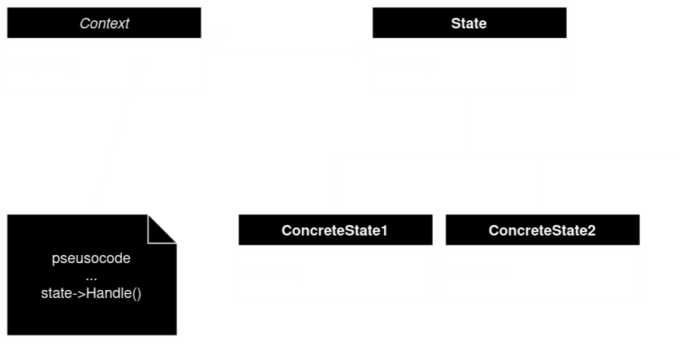

# State Pattern

## TLDR
Used to describe a finite state machine in your code, when an object can change its behavior depending on internal state.

## When to use
1. Object's behavior depends on internal state and needs to change behavior in real time.
1. When your code has many cases\if..else\enumerated statements.

## Description
### UML 

1. Context
    - defines interface of intrests to clients.
    - maintains an instance of concreteState(State1, State2) subclass that defines the current state.
1. State
    - defines interface for encapsulating the behavior associated with a particular state of the Context.
1. concreteState Subclass
    - each subclass implements a behavior associated with the state of the Context.

### Notes
- Transition implemitation
    - concreteState subclass defines the transition behavior, this forces an interface in Context to let State objects to change Context's current state.
        - Pros:
            - makes it easy to modify\extend concreteState.
        - Cons:
            - State subclasses have knowladge of atleast one other State subclass, this intreduces implemitation dependencies between subclasses.
    - If the transition rules are simple\fixed then Context can implement it.
    - Another way to define transition is using table mapping to define every state transtition to succeeding state.
        - Pros:
            - changing the transtion between state requires only changing values in a table and code.
        - Cons:
            - less efficient.
            - harder to understand.
            - difficult to add actions to state transition.
    > In Short: state pattern models state specifiec behavior, table approach focuses on defining state transition.
- Creation and destruction
    - create state object on demand and destroy after use
        - used when state have alot of data to store 
        - initial state is unknown and determined at runtime
    - create prior to use and never destroy
        - used when state changes are rapid
    > In short: both implemitations have diffrent use cases

## Code snippet
'''python

from __future__ import annotations
from abc import ABC, abstractmethod

class Context:
    _state = None

    def __init__(self, state: State) -> None:
        self.transition_to(state)

    def transition_to(self, state: State):
        self._state = state
        self._state.context = self

    def request1(self):
        self._state.handle1()

    def request2(self):
        self._state.handle2()

class State(ABC):
    @property
    def context(self) -> Context:
        return self._context

    @context.setter
    def context(self, context: Context) -> None:
        self._context = context

    @abstractmethod
    def handle1(self) -> None:
        pass

    @abstractmethod
    def handle2(self) -> None:
        pass

class ConcreteStateA(State):
    def handle1(self) -> None:
        self.context.transition_to(ConcreteStateB())

    def handle2(self) -> None:
        pass

class ConcreteStateB(State):
    def handle1(self) -> None:
        pass

    def handle2(self) -> None:
        self.context.transition_to(ConcreteStateA())

if __name__ == "__main__":
    # The client code.

    context = Context(ConcreteStateA())
    context.request1()
    context.request2()

'''
